# Skill Forge ⚔️

Quality-gated skill authoring for Claude Code. Build, judge, and ship skills that earn their tokens.

Forge is a collection of skills that work in sequence to hone a skill. Each pass through the cycle — recap, create or update, judge, apply — tightens the prompt until it earns a passing grade. You can enter the loop at any point and repeat until the result is sharp.



`skill-forge-judge` and `skill-forge-hitl` also work standalone — judge any prompt, step through any numbered list.


## Skills

**[skill-forge-recap](skill-forge-recap/)** — audits a skill by reading its body independently of its description. Reports what the skill *actually* does, flags undeclared behaviors, and verdicts drift as aligned / minor / significant. After the verdict, offers context-sensitive next steps: fix frontmatter via HITL, hand off to skill-forge-update, or run skill-forge-judge.

**[skill-forge-create](skill-forge-create/)** — builds a new skill from scratch: discovery recap loop to nail domain and failure modes, pattern selection, spec-fetching draft phase enforcing knowledge-delta discipline, then judge + HITL quality gate before install.

**[skill-forge-update](skill-forge-update/)** — structured update workflow for existing skills: recap, drift check, change elicitation loop with consistency checks, applies via HITL, judges the result, then saves and activates.

**[skill-forge-judge](skill-forge-judge/)** — evaluates any LLM-consumed prompt against a dimensional rubric (knowledge delta, anti-patterns, usability, spec compliance). Outputs a letter grade, per-dimension scores, and a numbered improvements list.

**[skill-forge-hitl](skill-forge-hitl/)** — Human-in-the-Loop: steps through any numbered list one item at a time. Shows a status board upfront, applies each change, prompts approve/revise/skip, and commits after each approval.

## Install

The five skills are designed to work in concert — `create` and `update` call `judge` and `hitl` as part of the quality gate, and `recap` feeds into `update`. Installing all five is recommended so the full forge cycle is available:

```
/plugin marketplace add WrathZA/skillforge
/plugin install skill-forge-recap
/plugin install skill-forge-create
/plugin install skill-forge-update
/plugin install skill-forge-judge
/plugin install skill-forge-hitl
```

## Principles

See [`principles.md`](principles.md). Short version: knowledge delta not tutorials, single-keypress menus, no cross-skill file deps, every NEVER needs WHY + INSTEAD, and skills are never finished — judge repeatedly, not just when something breaks.

## Local Development

Clone the repo and run `symlink-global-skills.sh` once to link skills globally on this machine:

```bash
bash symlink-global-skills.sh
```

Symlinks each skill directory into `~/.claude/skills/`, making them available to any Claude Code session regardless of working directory. Edits to the repo are immediately reflected. Safe to re-run — already-linked entries are skipped.

## Credits

- **[Matt Pocock](https://github.com/mattpocock)** ([aihero.dev](https://www.aihero.dev/)) — `write-a-skill`, the original skill this collection builds on
- **[softaworks/agent-toolkit](https://github.com/softaworks/agent-toolkit/tree/main/skills/skill-judge)** — `skill-judge`, the original eval skill `skill-forge-judge` is based on
